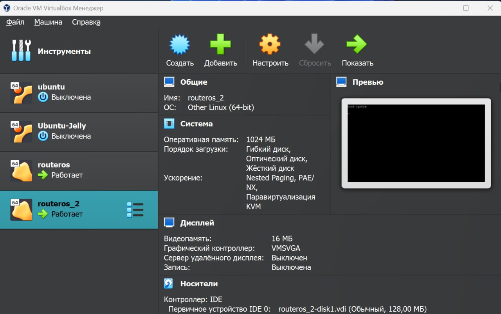
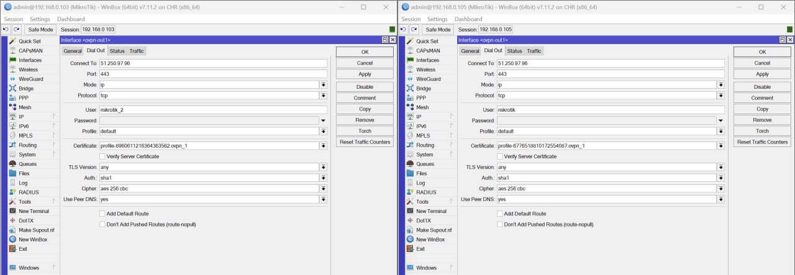
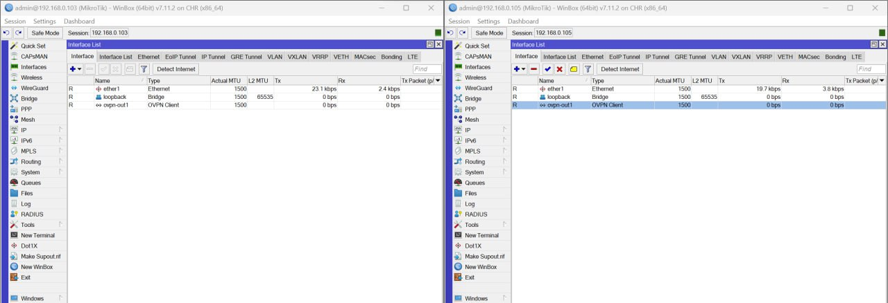
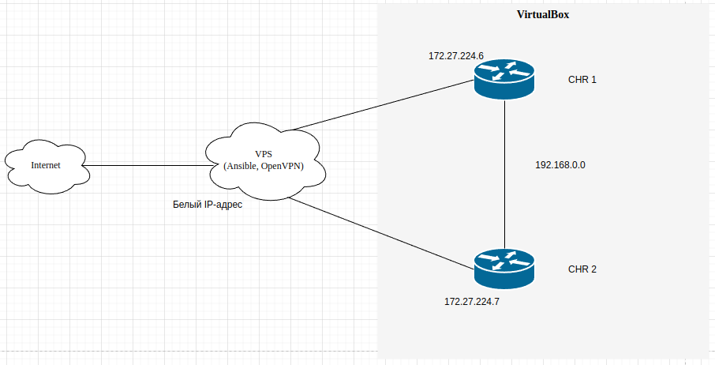
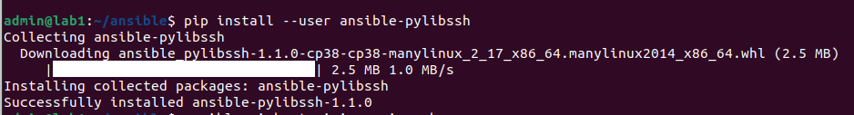
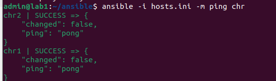
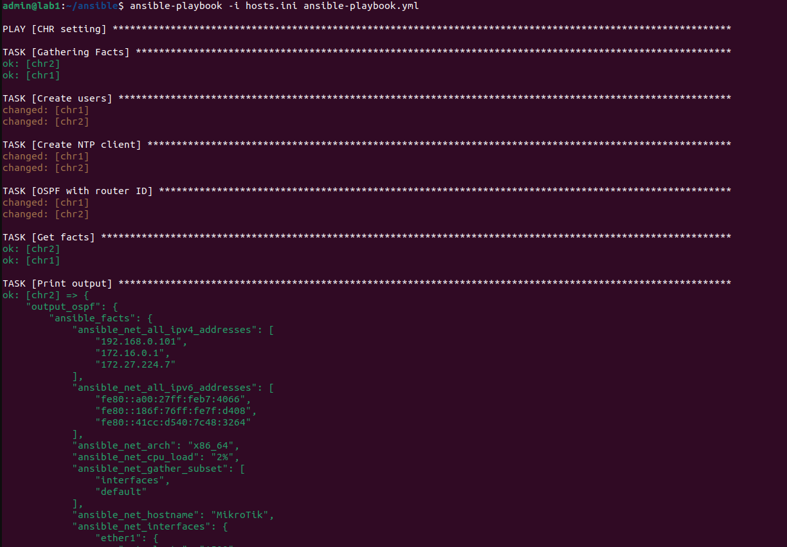

#### University: [ITMO University](https://itmo.ru/ru/)
##### Faculty: [FICT](https://fict.itmo.ru)
##### Course: [Network Programming](https://itmo-ict-faculty.github.io/network-programming/)

Group: K34202

Author: Davydov Anton Dmitrievich

Lab: Lab2

Date of create: 2.11.23

Date of finished: 13.11.23

## Отчёт по лабораторной работе №2 "Развертывание дополнительного CHR, первый сценарий Ansible"

**Цель работы:** С помощью Ansible настроить несколько сетевых устройств и собрать информацию о них. Правильно собрать файл Inventory.

**Ход работы:**

### 1. Установка второго CHR на хост

Используя Virtualbox мы склонировали созданную в прошлой работе машину с новыми настройками и получили вторую виртуальную машину с CHR



### 2. Настройка OVPN Client на втором CHR




### 3. Схема связи



### 4. Настройка CHR при помощи Ansible

Предварительно мы установили библиотеку для возможности подключаться к устройствам по ssh


Для применения конфигурации мы написали 2 файла:
- Файл инвентаря [hosts.ini](https://github.com/Antoshik143/2023_2024-network_programming-k34202-davydov_a_d/blob/main/lab2/hosts.ini), в котором указаны данные о серверах для конфигурирования.

Тестирование подключения через файл инввентаря при помощи ad-hoc команды ping



- [Ansible-playbook](https://github.com/Antoshik143/2023_2024-network_programming-k34202-davydov_a_d/blob/main/lab2/ansible-playbook.yml) для настройки конфигурации:
```
---
- name:  CHR setting
  hosts: chr
  tasks:
    - name: Create users
      routeros_command:
        commands: 
          - /user add name=stepananton group=read password=stepananton

    - name: Create NTP client
      routeros_command:
        commands:
          - /system ntp client set enabled=yes server=0.ru.pool.ntp.org
        
    - name: OSPF with router ID
      routeros_command:
        commands: 
          #- /ip address add address=10.10.10.1/30 interface=ether3 network=10.10.10.0
          - /interface bridge add name=loopback
          - /ip address add address=172.16.0.1 interface=loopback network=172.16.0.1
          - /routing id add disabled=no id=172.16.0.1 name=OSPF_ID select-dynamic-id=""
          - /routing ospf instance add name=ospf-1 originate-default=always router-id=OSPF_ID
          - /routing ospf area add instance=ospf-1 name=backbone
          - /routing ospf interface-template add area=backbone auth=md5 auth-key=admin interface=ether1

    - name: Get facts
      routeros_facts:
        gather_subset:
          - interfaces
      register: output_ospf

    - name: Print output
      debug:
        var: "output_ospf"
```

Запуск ansible-playbook при помощи команды:
```
ansible-playbook -i hosts.ini ansible-playbook.yml
```
Результат выполнения плейбука.


Результат сбора фактов после выполнения плейбука для каждой из машин представлен в файлах:
- [CHR 1 output](./configs/output_chr1.txt)
- [CHR 2 output](./configs/output_chr2.txt)

### 5. Проверка конфигурации

Созданные на машинах пользователи и NTP Clients:


проверка связности машин, а также OSPF на машинах.


Полный конфиг устройств представлен в файлах:

- [CHR 1 config](./configs/exp1.rsc)
- [CHR 2 config](./configs/exp2.rsc)


## Вывод:
В результате выполнения работы, используя Ansible, мы настроили несколько сетевых устройств, создав файл Inventory, и собрали информацию о них.