#### University: [ITMO University](https://itmo.ru/ru/)
##### Faculty: [FICT](https://fict.itmo.ru)
##### Course: [Network Programming](https://itmo-ict-faculty.github.io/network-programming/)

Group: K34202

Author: Davydov Anton Dmitrievich

Lab: Lab3

Date of create: 26.11.23

Date of finished: 06.12.23

# Отчёт по лабораторной работе №3 "Развертывание Netbox, сеть связи как источник правды в системе технического учета Netbox"

**Цель работы:** С помощью Ansible и Netbox собрать всю возможную информацию об устройствах и сохранить в отдельном файле.

**Ход работы:**

### 1. Установка Netbox

Netbox поднимался на том же сервере, где установлен OpenVPN и Ansible.

Воспользовались [оригинальной инструкцией](https://docs.netbox.dev/en/stable/installation/) для установки NetBox.

Для корректной работы NetBox понадобилось следующее ПО:

Python от 3.8
PostgreSQL от 12
Redis от 4.0

**Результаты установки:**

PostgreSQL

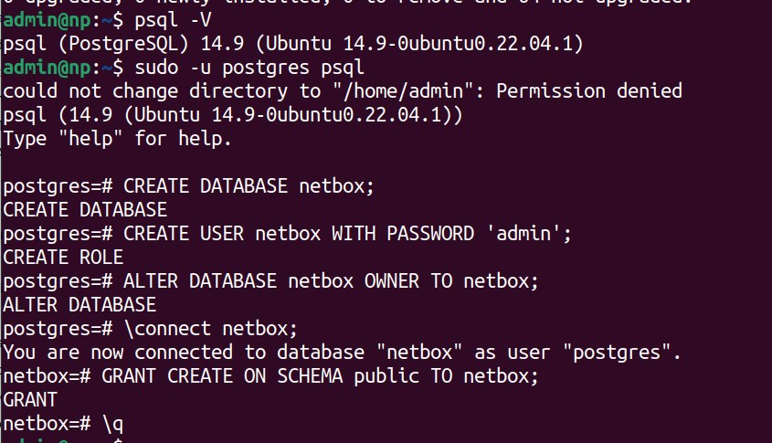

Redis

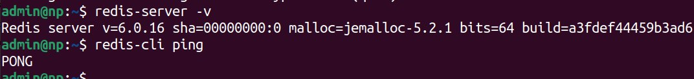

Настройка конфигурации Netbox

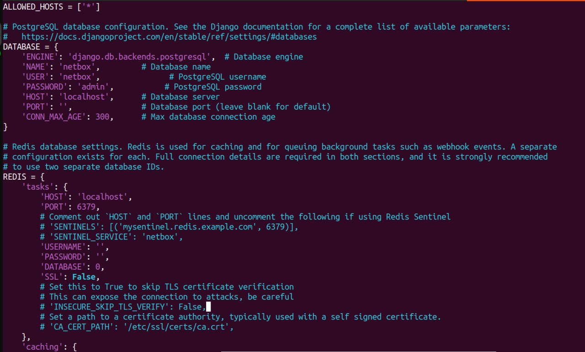
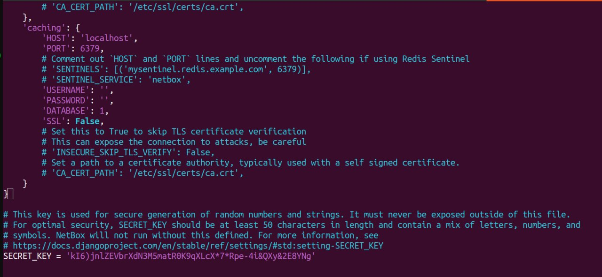

После успешной установки всех компонентов был запущен Netbox и протестирован его UI в браузере на порту 8000.

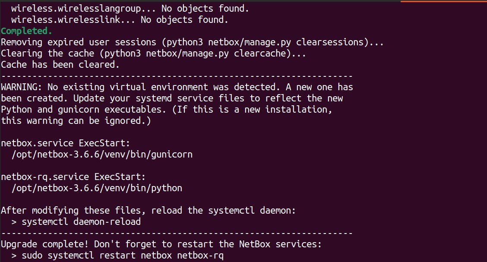

Интерфейс Netbox

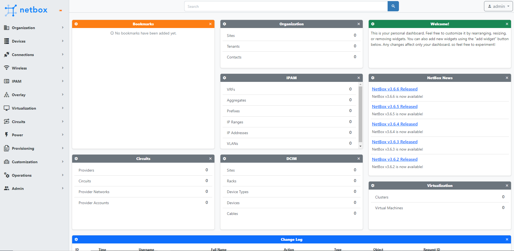

### 2. Заполнение информации о CHR в Netbox

Создали сайт, мануфактуру и роль. Создали 2 роутера. Для добавления Ip-адресов были добавлены интерфейсы для роутеров(во вкладке devices), позже IP-адресам были предоставлены интерфейсы, после роутерам IP.

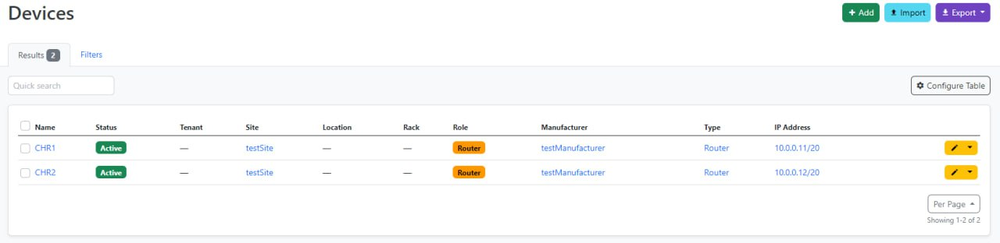

Дополнительно был создан токен для дальнейшего взаимодействия с Ansible.

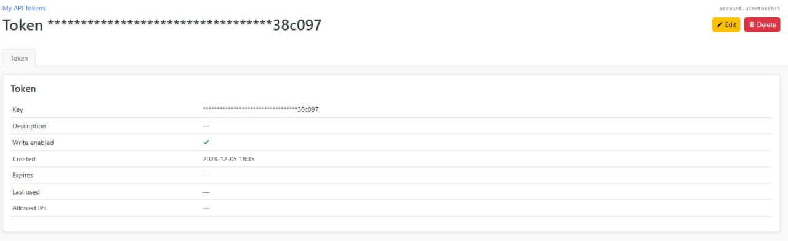

### 3. Получение данных об устройствах из Netbox при помощи Ansible

Установили роль для Netbox, используя Ansible-galaxy:

```
ansible-galaxy collection install netbox.netbox
```

Создадим файл [netbox_conf_galaxy.yml](./configs/netbox_conf_galaxy.yml) со следующим содержимым, куда добавили ранее созданный токен:

```
plugin: netbox.netbox.nb_inventory
api_endpoint: http://127.0.0.1:8000
token: 1ef9042ee515f716bdad25fe37e4ed531d38c097
validate_certs: True
config_context: False
interfaces: True
```

Запустили роль, сохранив вывод в файл netbox_inventory.yml (позже [netbox_inventory_copy.yml](./configs/netbox_inventory_copy.yml)).

```
ansible-inventory -v --list -y -i netbox_conf_galaxy.yml > netbox_inventory.yml
```
Из файла [hosts.ini](./configs/hosts.ini) добавили следующие параметры для подключения в итоговый файл  инвентаря [netbox_inventory.yml](./configs/inventory/netbox_inventory.yml), который положили в папку inventory:

```
vars:
    ansible_connection: ansible.netcommon.network_cli
    ansible_network_os: community.routeros.routeros
    ansible_user: admin
    ansible_ssh_pass: 12345
```

### 3. Создание сценариев Ansible, при помощи которых на основе данных из Netbox можно настроить 2 CHR, изменить имя устройства, добавить IP адрес на устройство.

[Ansible playbook](./configs/ansible-playbook.yml):
```
---
- name: Setup Routers
  hosts: ungrouped
  tasks:
    - name: "Change names of devicies"
      community.routeros.command:
        commands:
          - /system identity set name="{{ interfaces[0].device.name }}"

    - name: "Change IP-address"
      community.routeros.command:
        commands:
          - /ip address add address="{{ interfaces[0].ip_addresses[0].address }}" interface="{{ interfaces[0].display }}"
```

Запуск плэйбука:
```
ansible-playbook -i inventory ansible-playbook.yml
```

Результат выполнения плэйбука:

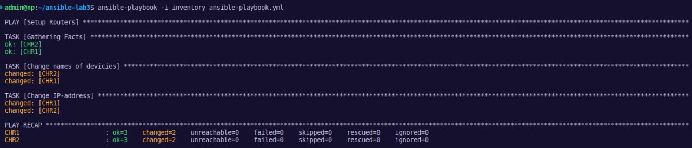

Измененные имена и IP-адреса

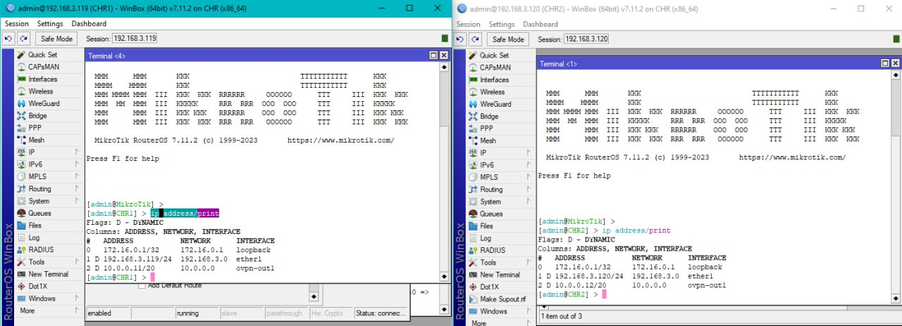

Отображение IP-адресов в Netbox:

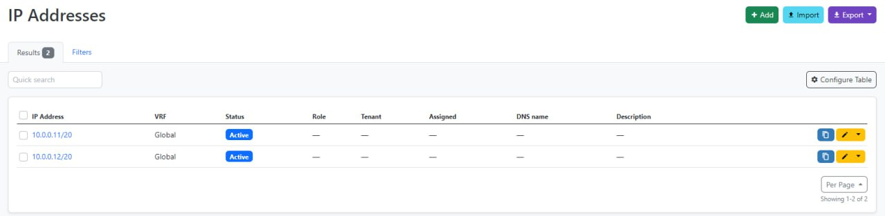

### 5. Создание сценария, позволяющего собрать серийный номер устройства и вносящий серийный номер в Netbox.

[Ansible playbook](./configs/serial_number-playbook.yml):

```
---
- name: Get Serial Numbers
  hosts: ungrouped
  tasks:

    - name: "Get Serial Number"
      community.routeros.command:
        commands:
          - /system license print
      register: license

    - name: "Get Name"
      community.routeros.command:
        commands:
          - /system identity print
      register: identity

    - name: Add Serial Number to Netbox
      netbox_device:
        netbox_url: http://127.0.0.1:8000
        netbox_token: 1ef9042ee515f716bdad25fe37e4ed531d38c097
        data:
          name: "{{ identity.stdout_lines[0][0].split()[1] }}"
          serial: "{{ license.stdout_lines[0][0].split()[1] }}"
```

Запуск плэйбука:

```
ansible-playbook -i inventory serial_number-playbook.yml
```

Результат выполнения плэйбука:

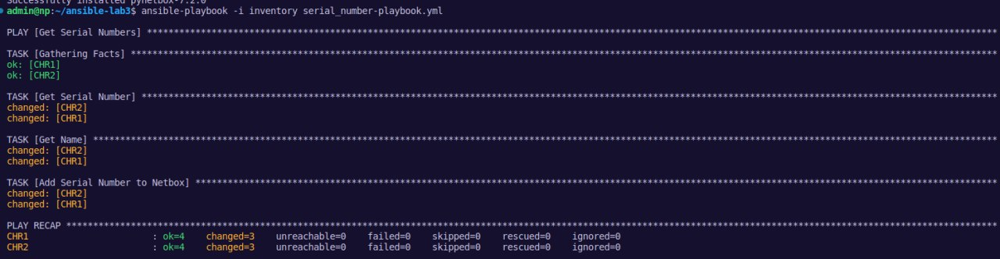

Добавленные серийные номера:

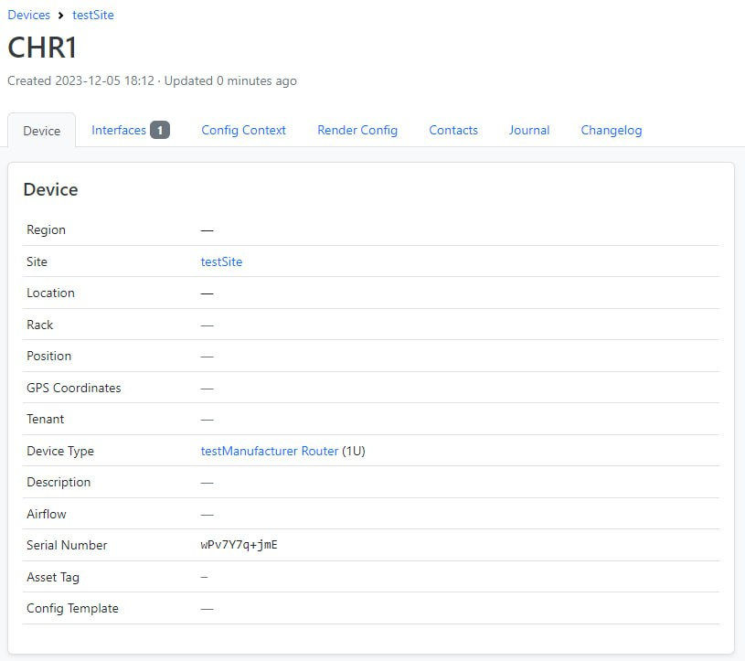
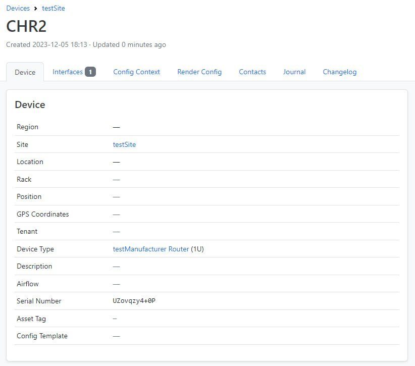

### Заключение

Результат проверки связности сети

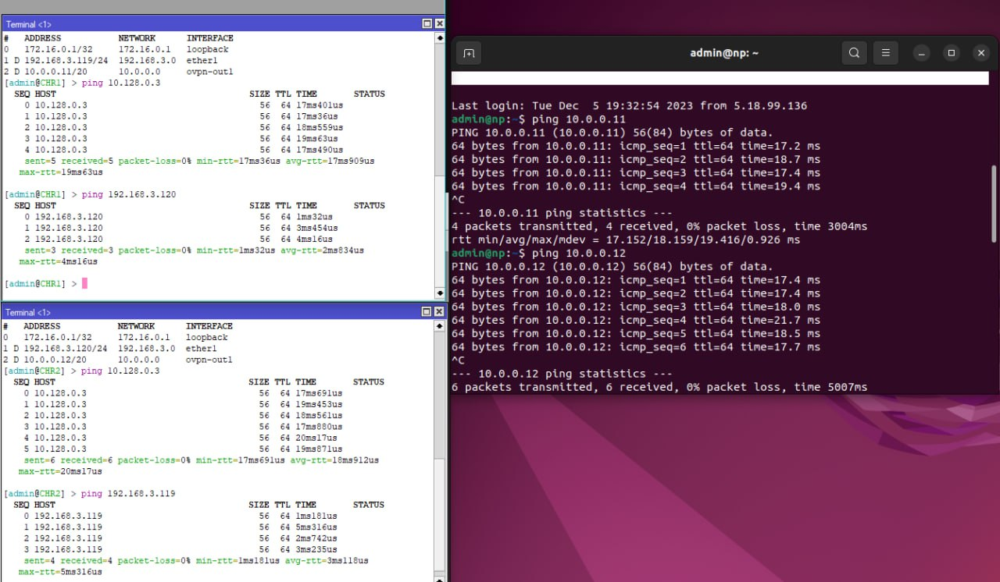

Схема связи сети

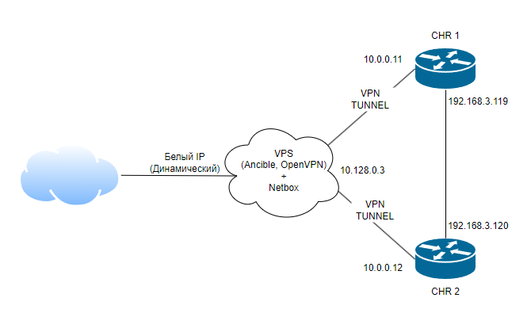

### Вывод
В результате выполнения работы c помощью Ansible и Netbox была собрана вся возможную информацию об устройствах и сохранена в отдельном файле.