#### University: [ITMO University](https://itmo.ru/ru/)
##### Faculty: [FICT](https://fict.itmo.ru)
##### Course: [Network Programming](https://itmo-ict-faculty.github.io/network-programming/)

Group: K34202

Author: Davydov Anton Dmitrievich

Lab: Lab4

Date of create: 01.12.23

Date of finished: 08.12.23

# Отчёт по лабораторной работе №4 "Базовая 'коммутация' и туннелирование используя язык программирования P4

**Цель работы:**
Изучить синтаксис языка программирования P4 и выполнить 2 обучающих задания от Open network foundation для ознакомления на практике с P4.

**Ход работы:**

### 1. Подготовка инфраструктуры

Перед началом работы проверили, что Vagrant установлен:

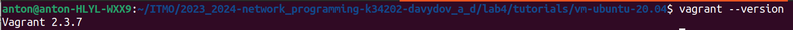

Склонировали репозиторий [p4lang/tutorials](https://github.com/p4lang/tutorials) перешли в директорию /tutorials/vm-ubuntu-20.04 и запустили Vagrant up, который установил на VirtualBox машину.

Запуск VagrantFile

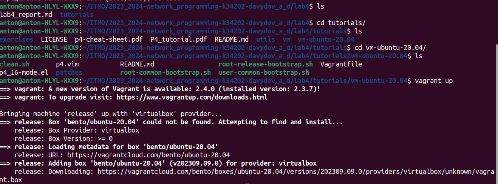

Установленная машина:

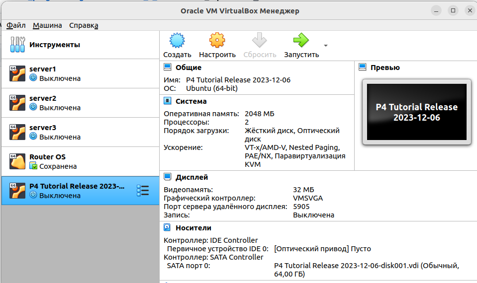

После чего запустили машину и зашли по пользователем P4, используя пароль - p4.

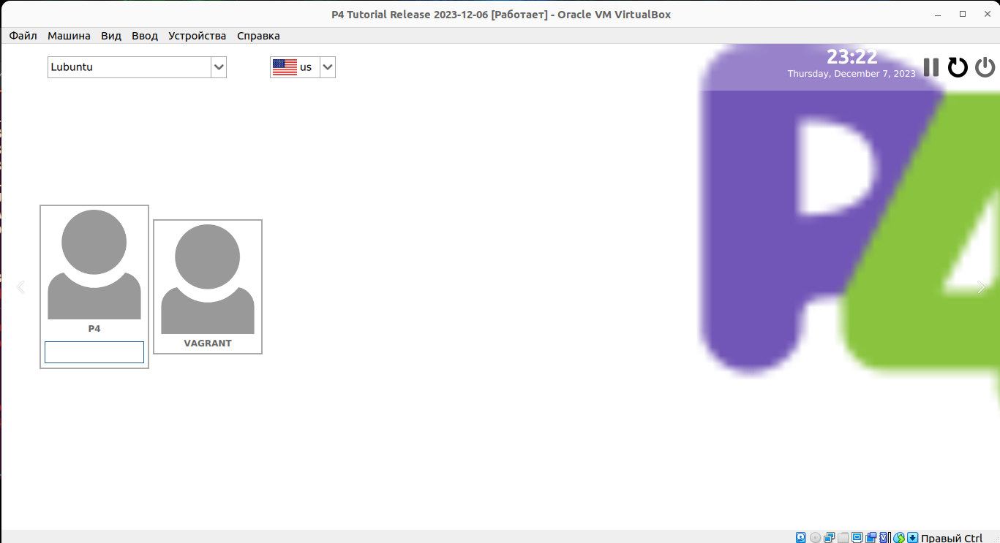

### 2. Implementing Basic Forwarding

В данном задании мы дополнили скрипт basic.p4 так, чтобы в сети заработала переадресация IP-пакетов.

Схема связи сохдаваемой сети:

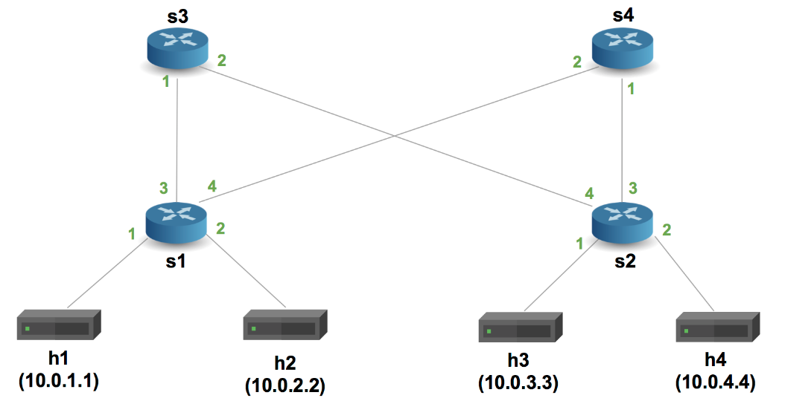

На машине перешли в директорию tutorials/exercices/basic и подняли виртуальную сеть Mininet, скомпилировав basic.p4, используя команду ниже. После чего попробовали пропинговать хосты.

```
make run
```

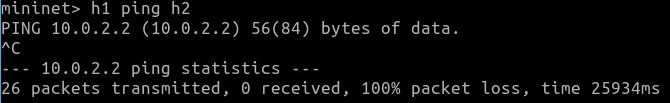

Как видно, ping не прошел, т. к. каждый коммутатор запрограммирован в соответствии с basic.p4, который отбрасывает все пакеты.

[Файл basic.p4](./basic.p4) содержит заготовку программы P4, в которой ключевые элементы логики заменены комментариями TODO. Добавим парсеры для Ethernet и IPv4, заполняющие поля ethernet_t и ipv4_t.

```
parser MyParser(packet_in packet,
                out headers hdr,
                inout metadata meta,
                inout standard_metadata_t standard_metadata) {

    state start { transition parse; }

    state parse{
      packet.extract(hdr.ethernet);
      transition select(hdr.ethernet.etherType) {
        TYPE_IPV4: parse_ipv4;
        default: accept;
        }
    }
      
    state parse_ipv4{
      packet.extract(hdr.ipv4);
      transition accept;
    }
}
```

Также написали действие (называемое ipv4_forward), которое:

- Устанавливает порт выхода для следующего узла.
- Обновляет MAC-адрес назначения Ethernet на адрес следующего узла.
- Обновляет MAC-адрес источника Ethernet на адрес коммутатора.
- Уменьшает значение TTL.
Добавили таблицу маршрутизации и условие проверки заголовка IPv4.

```
control MyIngress(inout headers hdr,
                  inout metadata meta,
                  inout standard_metadata_t standard_metadata) {
    action drop() {
        mark_to_drop(standard_metadata);
    }

    action ipv4_forward(macAddr_t dstAddr, egressSpec_t port) {
        standard_metadata.egress_spec= port; // Изменяем порт
        hdr.ethernet.srcAddr = hdr.ethernet.dstAddr; // Меняем адрес источника на свой
        hdr.ethernet.dstAddr = dstAddr; // Устанавливаем нового получателя
        hdr.ipv4.ttl = hdr.ipv4.ttl - 1; // Декрементируем TTL
    }

    table ipv4_lpm {
        key = {
            hdr.ipv4.dstAddr: lpm; // ключ таблицы
        }
        actions = {       // возможные действия
            ipv4_forward; 
            drop;
            NoAction;
        }
        size = 1024;    // размер таблицы
        default_action = NoAction(); // действие по умолчанию
    }

    apply {
        if(hdr.ipv4.isValid()){ // Недостающая часть (проверка)
          ipv4_lpm.apply();
        }
    }
```

А также написали депарсер, который выбирает порядок вставки полей в исходящий пакет.

```
control MyDeparser(packet_out packet, in headers hdr) {
    apply {
        packet.emit(hdr.ethernet);
        packet.emit(hdr.ipv4);
    }
}
```

Результат проверки пингов после настроек

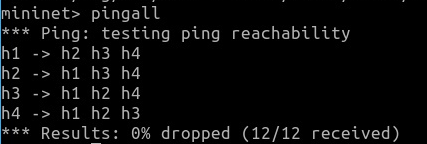

### 3. Implementing Basic Tunneling

В данном задании было туннелирование со следующей схемой связи:

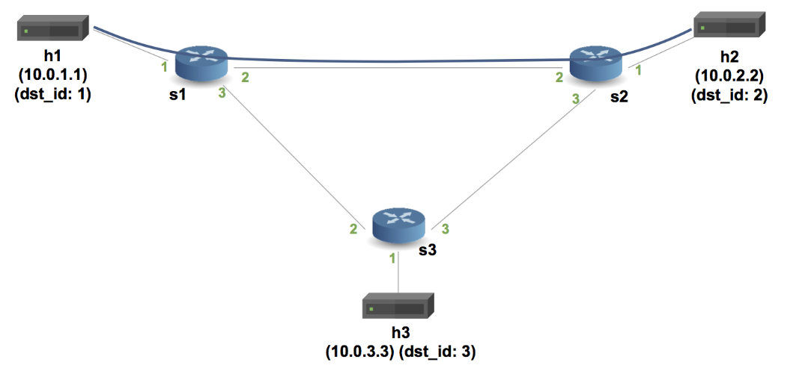

Дополнили [скрипт](./basic_tunnel.p4), добавив в него новый заголовок, таблицу, несколько проверок на валидность, а также дополнили парсер/депарсер, чтобы они обрабатывали дополнительный заголовок.

В директории basic_tunnel файл basic_tunnel.p4 содержит частичную реализацию базового IP-маршрутизатора. Полная реализация коммутатора basic_tunnel.p4 пересылает пакеты на основе содержимого пользовательского заголовка инкапсуляции, а также выполняет обычную IP-пересылку, если заголовок инкапсуляции отсутствует в пакете.

Парсер:

```
// TODO: Update the parser to parse the myTunnel header as well
parser MyParser(packet_in packet,
                out headers hdr,
                inout metadata meta,
                inout standard_metadata_t standard_metadata) {

    state start {
        transition parse_ethernet;
    }

    state parse_ethernet {
        packet.extract(hdr.ethernet);
        transition select(hdr.ethernet.etherType) {
            TYPE_MYTUNNEL: parse_myTunnel;
            TYPE_IPV4: parse_ipv4;
            default: accept;
        }
    }

    state parse_myTunnel {
        packet.extract(hdr.myTunnel);
        transition select(hdr.myTunnel.proto_id) {
            TYPE_IPV4: parse_ipv4;
            default: accept;
        }
    }

    state parse_ipv4 {
        packet.extract(hdr.ipv4);
        transition accept;
    }

}
```

Создали действие с именем myTunnel_forward, которое просто устанавливает порт выхода. Также добавили таблицу, аналогичную ipv4_lpm, но переадресацию заменили на туннельную. Обновили блок apply в блоке управления MyIngress, чтобы применить вновь определенную таблицу myTunnel_exact:

```
control MyIngress(inout headers hdr,
                  inout metadata meta,
                  inout standard_metadata_t standard_metadata) {
    action drop() {
        mark_to_drop(standard_metadata);
    }

    action ipv4_forward(macAddr_t dstAddr, egressSpec_t port) {
        standard_metadata.egress_spec = port;
        hdr.ethernet.srcAddr = hdr.ethernet.dstAddr;
        hdr.ethernet.dstAddr = dstAddr;
        hdr.ipv4.ttl = hdr.ipv4.ttl - 1;
    }

    table ipv4_lpm {
        key = {
            hdr.ipv4.dstAddr: lpm;
        }
        actions = {
            ipv4_forward;
            drop;
            NoAction;
        }
        size = 1024;
        default_action = drop();
    }

    // TODO: declare a new action: myTunnel_forward(egressSpec_t port)
    action myTunnel_forward(egressSpec_t port) {
        standard_metadata.egress_spec = port;
    }

    // TODO: declare a new table: myTunnel_exact
    // TODO: also remember to add table entries!
    table myTunnel_exact {
        key = {
            hdr.myTunnel.dst_id: exact;
        }
        actions = {
            myTunnel_forward;
            drop;
        }
        size = 1024;
        default_action = drop();
    }

    apply {
        // TODO: Update control flow
        if (hdr.ipv4.isValid() && !hdr.myTunnel.isValid()) {
            ipv4_lpm.apply();
        }

        if (hdr.myTunnel.isValid()) {
            myTunnel_exact.apply();
        }
    }
}
```

Добавили новый заголовок в депарсер:

```
control MyDeparser(packet_out packet, in headers hdr) {
    apply {
        packet.emit(hdr.ethernet);
        // TODO: emit myTunnel header as well
        packet.emit(hdr.myTunnel); // Заголовок туннеля
        packet.emit(hdr.ipv4);
    }
}
```

Запустили заново mininet и проверили связность.

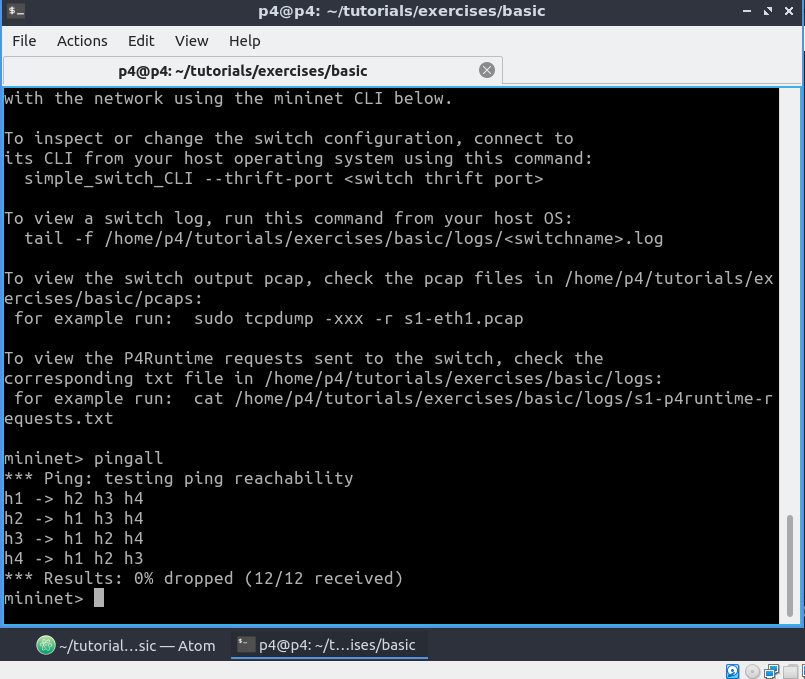

Для тестирования без туннелирования открыли 2 терминала h1 и h2 и отправили сообщение с h1 на h2

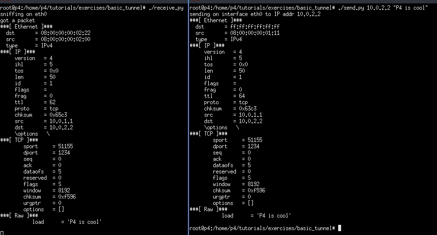

Пакет должен быть получен на h2.

Теперь мы протестируем с туннелированием.

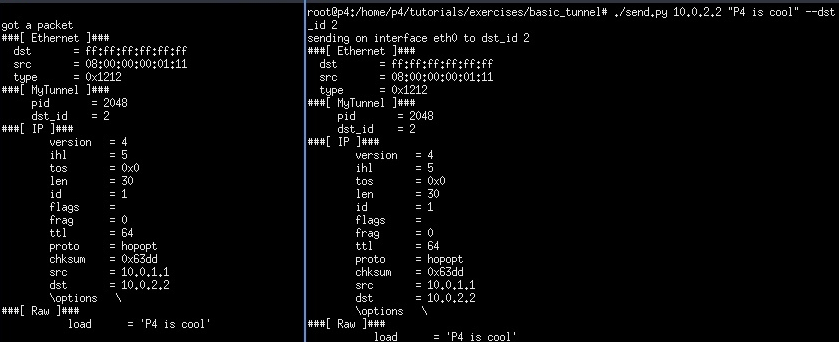

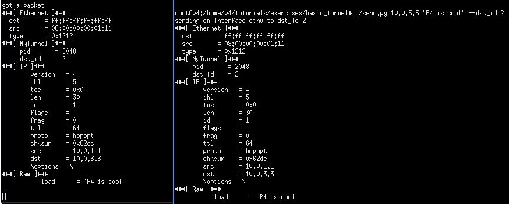

Пакет должен быть получен на h2, даже если этот IP-адрес является адресом h3. Это происходит потому, что коммутатор больше не использует IP-заголовок для маршрутизации, когда в пакете присутствует заголовок MyTunnel.

### Вывод

В результате выполнения работы был изучен синтаксис языка программирования P4 и выполнены 2 обучающих задания от Open network foundation для ознакомления на практике с P4.